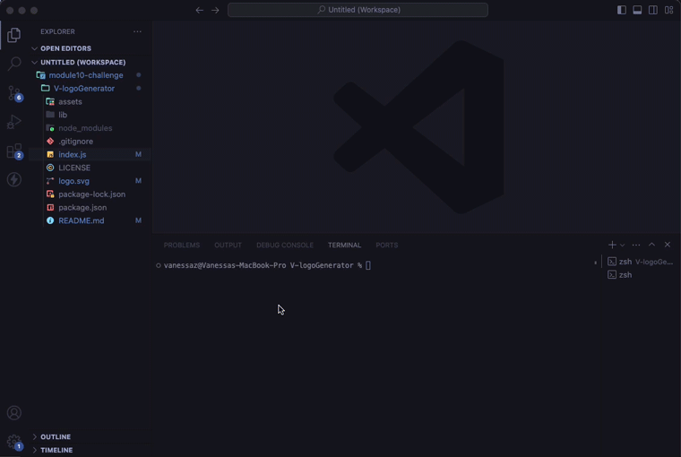

# SVG Logo Maker
  
The application prompts the user to select a color and shape, provide text for the logo, and save the generated SVG to a .svg file.
  
## User story
  
AS a freelance web developer I WANT to generate a simple logo for my projects SO THAT I don't have to pay a graphic designer
  
## Acceptance criteria
  
GIVEN a command-line application that accepts user input * WHEN I am prompted for text THEN I can enter up to 4 characters * WHEN I am prompted for the text color THEN I can enter a color keyword (OR a hexadecimal number) * WHEN I am prompted for a shape THEN I am presented with a list of shapes to choose from: circle, triangle, and square * WHEN I am prompted for the shape's color THEN I can enter a color keyword (OR a hexadecimal number) * WHEN I have entered input for all the prompts THEN an SVG file is created named `logo.svg` AND the output text "The logo has been saved as logo.svg!" is printed in the command line * WHEN I preview the `logo.svg` file THEN I am shown a 250x250 pixel image that matches the criteria I entered
  
## Go to my project
  
To visit and review my project, [click here](https://github.com/VanZittle/V-logoGenerator)
  
## Visual reference of project

You can take a look at the demo [here](https://drive.google.com/file/d/1vTuWqPdGEiaSJjCbCW96dKK8J38fBIOG/view?usp=drive_link)   
Also, the following image demonstrates the app's appearance:
  
[This app can be run in Terminal with Node.](./assets/challenge_appReference.gif)
  

## License
  Go to license [here](https://github.com/VanZittle/V-logoGenerator/blob/main/LICENSE)
  
Markdown generated with **[README Creator](https://github.com/VanZittle/module9-challenge-ReadmeGenerator)**